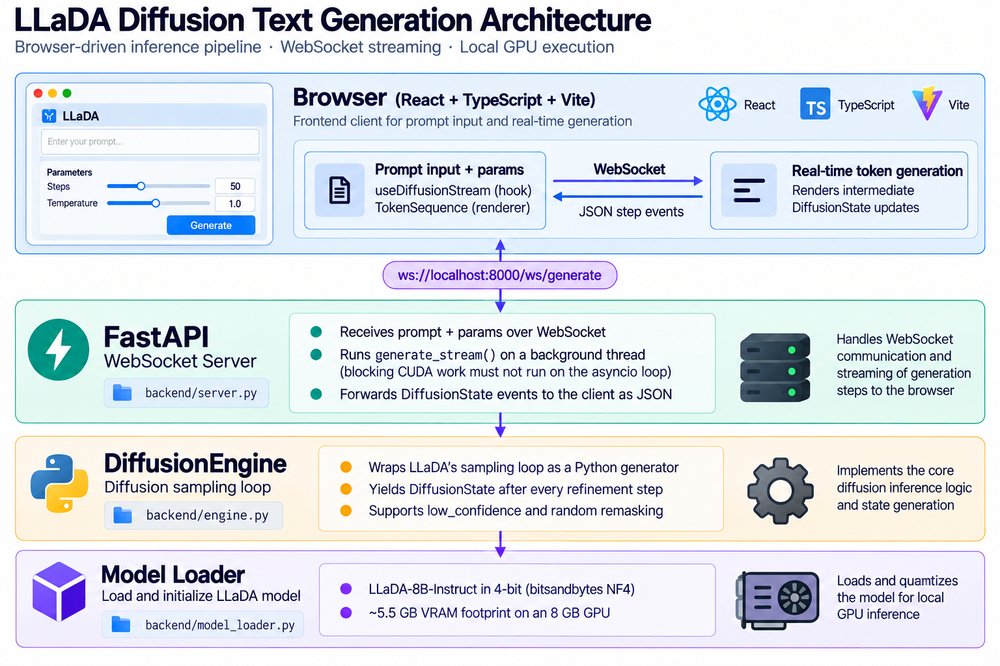

# Diffusion Language Model — Live Refinement Visualizer

> An interactive tool for observing how a masked diffusion language model generates text through iterative denoising — built to develop intuition for a generation paradigm that is fundamentally different from the autoregressive models that dominate today's landscape.

---

## Motivation

The dominant paradigm for language model generation is *autoregressive*: predict the next token, append it, repeat. It is simple, interpretable, and highly effective — but it is not the only way to generate text.

**Masked diffusion language models** take a different approach: they generate the *entire output sequence at once*, starting from a fully masked state, and iteratively refine it over many steps. The model can revise any position at any point — it is not constrained to generate left-to-right, and it can resolve ambiguous positions later as surrounding context becomes clearer.

This is an intellectually compelling alternative to autoregression, and it raises a natural question: *what does the refinement trajectory actually look like?* How does the model decide what to fill in first? Does it resolve the high-frequency structural words before the content words? Does it converge smoothly or oscillate?

Those questions are hard to answer just by reading a paper. This project makes the process directly observable — by intercepting every intermediate state of the generation loop and streaming it to a live browser interface where you can watch the sequence evolve in real time.

---

## What it does

Enter a prompt, click Generate, and watch the model transform a fully masked sequence into coherent text — one refinement step at a time:

```
STEP  0:  [■] [■] [■] [■] [■] [■] [■] [■] [■] [■] [■] [■]
STEP  4:  The [■] [■] [■] [■] network [■] uses [■] [■] [■]
STEP  8:  The transformer [■] neural [■] [■] uses attention [■]
STEP 12:  The transformer is a neural network that uses attention
STEP 16:  The transformer is a neural network that uses attention mechanisms
```

Every intermediate state is real model output — not a simulation or a post-hoc animation constructed from the final answer.

---

## The model: LLaDA-8B-Instruct

The backend runs **[LLaDA-8B-Instruct](https://huggingface.co/GSAI-ML/LLaDA-8B-Instruct)** (ML-GSAI, 2025) — an 8-billion parameter, instruction-tuned masked diffusion language model, and one of the first large-scale models of this type.

- Paper: [*Large Language Diffusion Models*, arXiv 2502.09992](https://arxiv.org/abs/2502.09992)
- Official implementation: [github.com/ML-GSAI/LLaDA](https://github.com/ML-GSAI/LLaDA)

---

## How masked diffusion generation works

### Initialization

The tokenized prompt is concatenated with a block of `gen_length` `[MASK]` tokens — one for each position to be generated:

```
[<prompt tokens>]  [MASK] [MASK] [MASK] ... [MASK]
                   ← generation region (all masked) →
```

### Iterative denoising

The model runs for `steps` iterations. Each iteration:

1. **Forward pass** — the full sequence (prompt + generation region) is passed through the transformer. The model outputs a probability distribution over the vocabulary for every masked position simultaneously.

2. **Token prediction** — for each masked position, the model selects its best guess via argmax (or via Gumbel sampling if `temperature > 0`).

3. **Confidence scoring** — the softmax probability of the chosen token is used as a confidence score. Positions where the model is highly confident are candidates to be permanently resolved; low-confidence positions will be re-masked.

4. **Token transfer** — a linearly-scheduled budget determines how many tokens to resolve at this step. The top-K most confident predictions are pinned; the rest remain masked for the next iteration.

5. **Repeat** — the number of masked positions decreases monotonically. The model attends to a progressively cleaner context with each step.

### Semi-autoregressive mode

When `block_length < gen_length`, the generation region is divided into blocks processed left-to-right. This is useful for longer outputs: attending over a fully masked long context can degrade quality, so blocks allow the model to condition later positions on already-resolved earlier ones.

### Key parameters

| Parameter | What it controls |
|-----------|-----------------|
| `steps` | Total denoising iterations (more = higher quality, slower) |
| `gen_length` | Number of tokens to generate |
| `block_length` | Semi-autoregressive block size; set equal to `gen_length` for fully parallel generation |
| `temperature` | Gumbel noise scale; `0` = deterministic greedy decoding |
| `remasking` | Re-masking strategy: `low_confidence` (keep most certain) or `random` |

---

## Implementation

### Core design decision

The reference LLaDA `generate()` function is a loop that returns only when generation is complete. The key modification is converting that loop into a Python generator that **yields the current token sequence after every step**:

```python
# Before: opaque — only the final result is visible
for step in range(steps):
    ... # refinement logic
return x

# After: every intermediate state is observable
for step in range(steps):
    ... # refinement logic
    yield DiffusionState(step=step, total_steps=steps, tokens=tokens)
```

This single structural change — `return` to `yield` — is what makes the entire visualizer possible. No modifications were made to the model architecture or the core sampling mathematics.

### System architecture



### WebSocket event protocol

```json
// Emitted after every diffusion step:
{
  "type": "step",
  "step": 7,
  "total_steps": 16,
  "tokens": [
    { "id": 791,    "text": "The",         "masked": false },
    { "id": 126336, "text": "[MASK]",       "masked": true  },
    { "id": 14121,  "text": "transformer", "masked": false }
  ]
}

// Emitted when generation is complete:
{ "type": "complete" }

// Emitted on any server-side error:
{ "type": "error", "message": "..." }
```

The frontend replaces the token sequence in-place on every `step` event. Tokens that transition from masked to resolved receive a brief fade-in animation (accent colour → body text) to draw attention to what the model just committed to — the only deliberate motion in the interface.

### Frontend state management

The `useDiffusionStream` React hook owns the WebSocket lifecycle: it opens a fresh connection on each generation request, parses incoming events, and exposes `{ status, tokens, step, totalSteps, error }` to the component tree. The `TokenSequence` component renders each token as an isolated element, making in-place updates possible without re-mounting the entire sequence.

---

## Project structure

```
Diffusion_Language_Model/
│
├── backend/
│   ├── engine.py            # DiffusionEngine — streaming generator wrapper
│   ├── model_loader.py      # 4-bit quantised model loading
│   └── server.py            # FastAPI WebSocket server
│
├── frontend/
│   └── src/
│       ├── App.tsx                        # Root component — prompt form + output panel
│       ├── hooks/useDiffusionStream.ts    # WebSocket connection and state management
│       ├── components/TokenSequence.tsx   # Per-token renderer (masked vs. resolved)
│       └── index.css                      # Tailwind base + token-reveal keyframe
│
└── download_model.py   # Downloads the checkpoint to ./checkpoints/ (not system cache)
```

---

## Tech stack

| Layer | Technology |
|-------|-----------|
| Model | LLaDA-8B-Instruct (GSAI-ML) |
| Quantisation | bitsandbytes NF4 4-bit |
| ML framework | PyTorch 2.6 + CUDA 12.4 |
| Model loading | Hugging Face Transformers + Accelerate |
| Backend | Python 3.10, FastAPI, Uvicorn |
| Transport | WebSocket (native browser API + `websockets` Python library) |
| Frontend | React 18, TypeScript, Vite, Tailwind CSS |

---

## Setup

### Prerequisites

- Python 3.10+
- NVIDIA GPU with **≥ 8 GB VRAM** (developed and tested on RTX 4060 Laptop 8 GB)
- CUDA 12.x drivers installed
- Node.js 18+
- ~20 GB free disk space for the model checkpoint

### 1. Create the virtual environment

```bash
python -m venv .venv

# Windows
.\.venv\Scripts\Activate.ps1

# macOS / Linux
source .venv/bin/activate
```

### 2. Install backend dependencies

```bash
# PyTorch with CUDA 12.4
pip install torch --index-url https://download.pytorch.org/whl/cu124

# Backend stack
pip install transformers accelerate bitsandbytes scipy numpy fastapi uvicorn websockets
```

### 3. Download the model

The checkpoint is approximately 16 GB. The download script saves it directly to `./checkpoints/LLaDA-8B-Instruct`, bypassing the default Hugging Face cache directory.

```bash
python download_model.py
```

### 4. Start the backend server

```bash
cd backend
uvicorn server:app --host 0.0.0.0 --port 8000
```

The server will load the model on startup (this takes 30–60 seconds on first load). Confirm it is running at [http://localhost:8000](http://localhost:8000).

> Avoid `--reload` — it re-triggers the full model load on every file change.

### 5. Start the frontend

```bash
cd frontend
npm install
npm run dev
```

Open [http://localhost:5173](http://localhost:5173).

---

## Configuration

### Environment variables

| Variable | Default | Description |
|----------|---------|-------------|
| `LLADA_MODEL_PATH` | `./checkpoints/LLaDA-8B-Instruct` | Local checkpoint path; falls back to the Hugging Face Hub repo ID if the path does not exist |
| `VITE_WS_URL` | `ws://localhost:8000/ws/generate` | WebSocket URL used by the frontend (set in `frontend/.env.local`) |

### Generation parameters

| Parameter | Default | Notes |
|-----------|---------|-------|
| `steps` | 50 | More steps produce higher-quality output at the cost of speed |
| `gen_length` | 100 | Number of tokens to generate |
| `block_length` | 100 | Set equal to `gen_length` for fully parallel generation |
| `temperature` | 0 | Fixed at greedy decoding for deterministic output |
| `remasking` | `low_confidence` | Tokens with the lowest prediction confidence are re-masked each step |

---

## Known limitations

**Single-user concurrency.** The server holds a generation lock so only one request runs at a time — a deliberate constraint given that a single 8B forward pass already uses most of the available VRAM on an 8 GB card.

**No cancellation.** Closing the browser mid-generation leaves the background thread running until the current block completes. The thread then terminates cleanly once it finds no consumer on the result queue. Implementing a proper cancellation signal is a straightforward future extension.

**VRAM headroom.** 4-bit quantisation reduces the model weight footprint to approximately 5.5 GB, leaving ~2.5 GB for activations. This is comfortable for `gen_length ≤ 128`; longer generations that require attending over larger sequences will consume more activation memory and may approach the card's limit.

**Special tokens in the output.** Chat-template tokens (`<|eot_id|>`, `<|end_of_text|>`, etc.) are rendered with muted styling rather than stripped, because removing them would mean the visualizer is showing post-processed rather than raw model output.

---

## Acknowledgements

- **LLaDA / ML-GSAI** — model architecture, training, and the reference `generate.py` implementation that this project adapts.
- **bitsandbytes** (Tim Dettmers et al.) — 4-bit NF4 quantisation, without which running an 8B model on consumer 8GB VRAM would not be feasible.
- **Hugging Face** — Transformers and Accelerate for model loading and device management.
